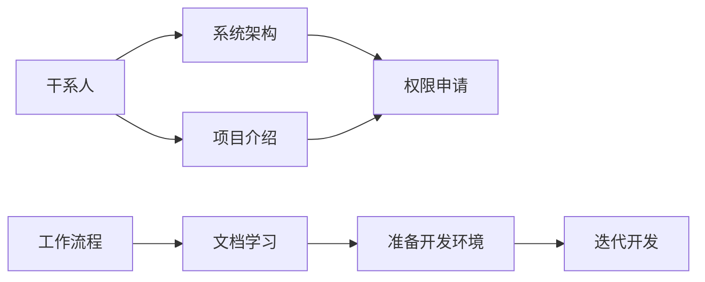

import { Meta } from "@storybook/blocks";
import Mermaid from "react-mermaid2"

<Meta title="介绍/Onbording" />

## 步骤

1. 干系人
2. 工作流程
3. 系统架构
4. 项目介绍
  - 前端
  - 后端
5. 权限申请
  - gitlab
  - 邮件
  - CICD
6. 文档学习
7. 准备开发环境
8. 迭代开发
